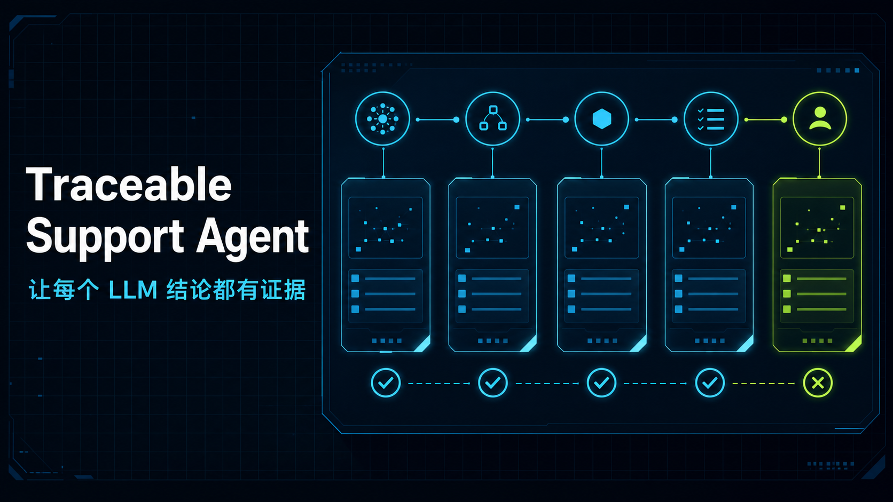

# Traceable Support Agent

一个面向 AI 应用工程师岗位的可追溯客服决策支持项目。系统使用合成知识与合成工单，展示混合检索、两阶段生成、证据绑定、机械质量门、失败关闭与人工最终决定怎样组合成可审查的 LLM Workflow。



[在线体验](https://47.84.34.86/) · [设计说明](https://47.84.34.86/design) · [QA / 工单体验](https://47.84.34.86/app) · [公开主张证据](docs/product/evidence-map.md)

> 当前版本是公开 Beta 回放版，健康状态为 `replay_only`。Stage 12 已执行一次（19/24 案例、9 通过），暴露候选生成合同高失败率和两条边界缺陷；`product/0.1.0` 尚未发布。本候选为公开合成安全风险和 CZ-R1 / CZ-R2 独占能力冲突增加生成前确定性转人工回归，但没有重跑或改写 Stage 12。

## 60 秒体验

1. 打开 [QA / 工单体验](https://47.84.34.86/app)；
2. 选择 CZ-R1 局部清扫或 CZ-R2 地毯风险预设并运行回放；
3. 查看阶段轨迹、来源、客户可见义务和机械质量门；
4. 尝试批准、编辑后批准或拒绝，确认人工决定不会触发外部业务动作。

第三个“证据不足转人工”预设展示无批准来源时在 Provider 调用前停止；它是已验证回放，不是一次新的实时模型调用。

## 工程亮点

- **混合检索**：型号边界过滤后组合 BM25、BGE 与 RRF，并冻结有序检索 fixture。
- **生成前边界**：公开合成安全事件和明确的型号独占能力冲突在 transport 构造前转人工。
- **两阶段生成**：先枚举客户可见义务，再生成 QA 回复或工单候选。
- **证据与失败绑定**：机械门检查来源、义务、结构、安全和虚假完成态；证据不足时转人工。
- **受控运行**：Provider 位于服务端边界，调用前检查预算、隐私和授权，自动重试为 0。
- **可复现交付**：标准 Next.js `standalone`、Python API、锁定依赖、非 root 容器、不可变镜像发布和生产回滚演练。

## 产品边界

- QA 与工单双入口；结果包含来源、义务清单、候选正文、质量门和人工决定。
- 证据不足、安全风险、越界或技术失败时转人工，不包装为成功。
- 批准只表示“等待外部动作”；系统不会发送回复、退款、换新或结单。
- 只使用虚构品牌和合成数据，不接入真实客服、订单或客户信息。
- 当前公网 Provider 关闭，页面在服务不可用时仍可展示已验证回放。

## 架构

```text
Browser → Next.js portfolio → Python HTTP API
                                      ├─ Run service / SQLite / budget / queue
                                      └─ ProductRunner
                                           ├─ pre-generation boundary handoff
                                           ├─ hybrid retrieval
                                           ├─ two-stage generation
                                           └─ mechanical validation
                                                     ↓
                                              human decision
```

运行依赖方向固定为：

```text
HTTP API → Product → Retrieval / Generation / Provider
Evals → Product
```

产品运行包不得反向依赖评测、脚本或历史实验代码。

## 本地运行

推荐使用回放版容器，不需要模型或 Provider 密钥：

```bash
docker compose -f deploy/compose.local.yaml up --build
```

默认地址：Web <http://127.0.0.1:3000/>，API <http://127.0.0.1:8000/api/v1/health>。

手动开发需要 Python `>=3.11`、Node.js `>=22.13.0`，并在两个 PowerShell 终端中分别启动 API 和 Web。

终端 A：

```powershell
$env:PYTHONPATH = "api/src"
$env:TRACEABLE_PUBLIC_DB = "$PWD/.local-public.sqlite3"
$env:TRACEABLE_PUBLIC_ORIGIN = "http://127.0.0.1:3000"
python -m traceable_support.api.http
```

终端 B：

```powershell
Set-Location web
$env:NEXT_PUBLIC_API_BASE_URL = "http://127.0.0.1:8000"
npm ci
npm run dev
```

以上两种方式都保持 `replay_only`；完整测试和固定模型入口见[质量策略](docs/engineering/quality.md)。

## 仓库导航

| 路径 | 职责 |
| --- | --- |
| [`web/`](web/) | 产品主页、设计说明、在线体验和隐私页 |
| [`api/`](api/) | 公共 API、产品运行链、检索、生成和 Provider 边界 |
| [`evals/`](evals/) | 公开回归案例、合同和离线评测入口 |
| [`data/knowledge/`](data/knowledge/) | 六份合成知识资料 |
| [`docs/product/`](docs/product/) | [架构](docs/product/architecture.md)、[设计](docs/product/design.md)、[限制](docs/product/limitations.md)和[公开主张证据](docs/product/evidence-map.md) |
| [`docs/engineering/`](docs/engineering/) | 开发、质量、评测、运维和安全协议 |
| [`docs/meta/`](docs/meta/) | 元开发定义、原则、演进记录和精选案例 |
| [`deploy/`](deploy/) | 容器、Caddy、发布清单和回滚部署 |

稳定产品事实以 [`PROJECT.md`](PROJECT.md) 为准，唯一开发状态以 [`docs/status.md`](docs/status.md) 为准，结果路线以 [`ROADMAP.md`](ROADMAP.md) 为准。

## 许可

本仓库未授予开源许可证。源码公开供查看和求职评审，版权保留；未经许可不得复制、分发或用于衍生项目。
