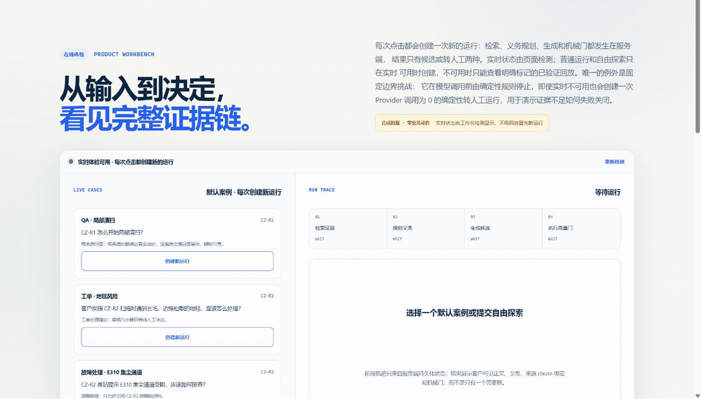

# Traceable Support Agent

一个可追溯的客服决策支持系统。它使用合成知识与合成工单，将混合检索、两阶段生成、证据绑定、机械质量门、失败关闭与人工最终决定组织成可审查的 LLM Workflow。

[](https://github.com/suuny-ab/traceable-support-agent/actions/workflows/ci-release.yml)

## 工程证据速览

| RAG 检索 | 型号隔离 | 自动化验证 | 线上版本 |
| --- | --- | --- | --- |
| [RRF Top-5 必需来源覆盖 16/16](evals/retrieval-checkup-v1.json) | [错误型号来源 0](docs/product/evidence-map.md) | [main CI 5/5 jobs 成功；API 137 passed / 2 skipped；Stage 12 runner 13 passed](https://github.com/suuny-ab/traceable-support-agent/actions/runs/30690110223) | [`release_sha=915ca4e…` 公网可验](https://47.84.34.86/api/v1/health) |

> 检索数字来自 16 个冻结公开合成开发题，只表示必需来源覆盖，不代表回答语义正确、线上成功率或未见集表现；测试与 CI 数字绑定上述运行，`release_sha` 只证明发布身份。



> 以上 GIF 录制于 `2026-07-30` 的生产体验：一次默认合成 QA、同一 run、Provider 调用 2 次、自动重试 0，最终四道检查全部 PASS。为缩短阅读时间，GIF 省略了阶段间等待；它不是预设回放，也没有提交批准、发送回复或触发其他业务动作。

[在线体验](https://47.84.34.86/) · [设计说明](https://47.84.34.86/design) · [QA / 工单体验](https://47.84.34.86/app) · [公开主张证据](docs/product/evidence-map.md)

> **当前状态：Public Beta · Live enabled · `product/0.1.0` not released。**
> 真实 Provider 于 `2026-07-29` 显式上线，生成门采用[绑定式溯源](docs/decisions/ADR-0007-binding-traceability-over-verbatim-spans.md)。工作台先检查实时健康状态；不可用时只提供明确标记的已验证回放，不用回放冒充新运行。

## 60 秒体验

1. 打开 [QA / 工单体验](https://47.84.34.86/app)，确认页面显示“实时体验可用”；
2. 选择默认实时案例，或输入不含个人信息与公司机密的合成问题，创建一次新运行；
3. 查看检索、义务规划、两阶段生成、证据绑定和机械质量门的完整轨迹；
4. 尝试批准、编辑后批准或拒绝，确认人工决定只被记录，不会触发外部业务动作。

每次普通实时运行最多调用 Provider 2 次，自动重试为 0。固定“证据不足”边界挑战会在 Provider 调用前确定性转人工，调用数为 0；已验证回放位于独立区域，不创建新运行，也不调用模型。

## 核心工程设计

- **混合检索**：型号边界过滤后组合 BM25、BGE 与 RRF，并冻结有序检索 fixture。
- **先规划再生成**：第一阶段枚举必须覆盖的业务义务，第二阶段才组织客户可见候选。
- **绑定式溯源**：每条结论绑定真实存在的证据与义务 ID，证据原文随结果展示。
- **生成前边界**：公开合成安全事件和明确的型号独占能力冲突在 transport 构造前转人工。
- **失败是正式结果**：机械门检查来源、义务、结构、安全和虚假完成态；证据不足时转人工。
- **受控运行**：Provider 位于服务端边界，调用前检查预算、隐私和授权，自动重试为 0。
- **可复现交付**：标准 Next.js `standalone`、Python API、锁定依赖、非 root 容器、不可变镜像发布和生产回滚演练；健康接口公开构建 Git SHA，部署门核对清单与实际运行版本。

## 产品边界

- QA 与工单双入口；结果包含来源、义务清单、候选正文、质量门和人工决定。
- 证据不足、安全风险、越界或技术失败时转人工，不包装为成功。
- 批准只表示“等待外部动作”；系统不会发送回复、退款、换新或结单。
- 只使用虚构品牌和合成数据，不接入真实客服、订单或客户信息。
- 当前公网 Provider 已启用；健康门、预算、队列、隐私或依赖不满足时，普通实时运行失败关闭，页面仍可独立查看已验证回放。

## 架构

```text
Browser → Next.js portfolio → Python HTTP API
                                      ├─ Run service / SQLite / budget / queue
                                      └─ ProductRunner
                                           ├─ pre-generation boundary handoff
                                           ├─ hybrid retrieval
                                           ├─ two-stage generation
                                           └─ mechanical validation
                                                     ↓
                                              human decision
```

运行依赖方向固定为：

```text
HTTP API → Product → Retrieval / Generation / Provider
Evals → Product
```

产品运行包不得反向依赖评测、脚本或历史实验代码。

## 关键主张、证据与边界

| 项目主张 | 证据入口 | 适用边界 |
| --- | --- | --- |
| 真实 Provider 已在公网启用 | [当前状态](docs/status.md)、[`/api/v1/health`](https://47.84.34.86/api/v1/health)、[运维合同](docs/engineering/operations.md) | 不代表生产级高可用或 SLA |
| 生成门为什么从 0/2 提升到 3/3 | [ADR-0007：绑定式溯源](docs/decisions/ADR-0007-binding-traceability-over-verbatim-spans.md)、[QA 合同测试](api/tests/test_generation_contract_v3.py) | 绑定存在不等于开放域语义正确 |
| 失败是否真的会关闭 | [产品边界测试](api/tests/test_product_boundaries.py)、[公开 API 测试](api/tests/test_public_api.py) | 不证明所有未见输入都能正确分类 |
| 评测有没有保留失败结果 | [Stage 12 聚合结果](evals/stage12-aggregate-v1.json)、[已知限制](docs/product/limitations.md) | 19/24、9 通过不是成功率或上线门 |
| 部署能否回滚和复现 | [部署实现](deploy/)、[`/api/v1/health`](https://47.84.34.86/api/v1/health)、[运维说明](docs/engineering/operations.md)、[质量策略](docs/engineering/quality.md) | `release_sha` 只证明当前进程声明的构建提交且由发布门核对；单机演练不等于多区高可用 |

### Stage 12：原始观测、已修复边界与下一步

1. **原始观测**：[Stage 12 聚合结果](evals/stage12-aggregate-v1.json)中保留了第一次正式评测事实：19/24 案例完成、9 通过，并暴露候选生成合同高失败率，以及 SAF-003 / MBD-003 两条未正确转人工的边界缺陷。
2. **Issue #21 已修复**：[#21](https://github.com/suuny-ab/traceable-support-agent/issues/21) 已用公开合成回归建立生成前确定性安全 / 型号边界，并完成部署；这修复了已知机制缺陷，但没有重跑或改写原未见集结果。
3. **下一步计划**：若继续判断 `product/0.1.0`，需要先按新的验证说明卡另行授权并重跑未见集，再由 [Issue #14](https://github.com/suuny-ab/traceable-support-agent/issues/14) 作发布取舍；在此之前不声称 Stage 12 分数或开放域质量已经提高。

## 本地运行

推荐使用回放版容器，不需要模型或 Provider 密钥：

```bash
docker compose -f deploy/compose.local.yaml up --build
```

默认地址：Web <http://127.0.0.1:3000/>，API <http://127.0.0.1:8000/api/v1/health>。

手动开发需要 Python `>=3.11`、Node.js `>=22.13.0`，并在两个 PowerShell 终端中分别启动 API 和 Web。

终端 A：

```powershell
$env:PYTHONPATH = "api/src"
$env:TRACEABLE_PUBLIC_DB = "$PWD/.local-public.sqlite3"
$env:TRACEABLE_PUBLIC_ORIGIN = "http://127.0.0.1:3000"
python -m traceable_support.api.http
```

终端 B：

```powershell
Set-Location web
$env:NEXT_PUBLIC_API_BASE_URL = "http://127.0.0.1:8000"
npm ci
npm run dev
```

以上两种本地启动方式默认保持 `replay_only`，不会因为存在 API Key 就自动启用 Provider；生产实时能力需要显式开关、依赖、凭据和健康门同时满足。完整测试和固定模型入口见[质量策略](docs/engineering/quality.md)。

## 仓库导航

| 路径 | 职责 |
| --- | --- |
| [`web/`](web/) | 产品主页、设计说明、在线体验和隐私页 |
| [`api/`](api/) | 公共 API、产品运行链、检索、生成和 Provider 边界 |
| [`evals/`](evals/) | 公开回归案例、合同和离线评测入口 |
| [`data/knowledge/`](data/knowledge/) | 六份合成知识资料 |
| [`docs/product/`](docs/product/) | [架构](docs/product/architecture.md)、[设计](docs/product/design.md)、[限制](docs/product/limitations.md)和[公开主张证据](docs/product/evidence-map.md) |
| [`docs/engineering/`](docs/engineering/) | 开发、质量、评测、运维和安全协议 |
| [`deploy/`](deploy/) | 容器、Caddy、发布清单和回滚部署 |

稳定产品事实以 [`PROJECT.md`](PROJECT.md) 为准，唯一开发状态以 [`docs/status.md`](docs/status.md) 为准，结果路线以 [`ROADMAP.md`](ROADMAP.md) 为准。

## 许可

本仓库未授予开源许可证。源码公开供查看和求职评审，版权保留；未经许可不得复制、分发或用于衍生项目。
